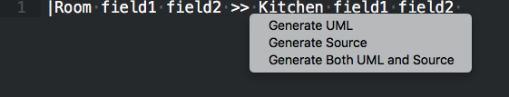

# Prexel - Sublime Text plugin

## Installation

### Step 1 - Download Sublime Text 3 (Optional)

First, a copy of Sublime Text 3 should be installed. It can be downloaded at:

    https://www.sublimetext.com/

### Step 2 - Find the Sublime Text 3rd-party packages folder

After downloading and installing Sublime Text, in your file system (e.g., Windows Explorer or Finder), navigate to the "Packages" folder for Sublime Text. This is where Sublime Text installs all third-party plugins. The "Packages" directory location for various 
operating systems can be found below.

**Windows**

	%APPDATA%\Sublime Text 3\Packages

**MAC/OSX**

	~/Library/Application Support/Sublime Text 3/Packages

**LINUX**

	~/.config/sublime-text-3/Packages

**NOTE: Make sure you aren't inside any of the default "Packages" directories for Sublime Text 3**, which are listed below.
These locations are for default Sublime Text plugins and settings.

**Windows**

	c:\Program Files\Sublime Text 3\Packages or
	c:\Program Files(x86)\Sublime Text 3\Packages

**MAC/OSX**

	/Applications/Sublime Text.app/Contents/MacOS/Packages

**LINUX**

	/opt/sublime_text/Packages

### Step 3 - Clone or download the PREXEL plugin files

Once inside of the packages directory, run the following command to check out the plugin to the current 
directory. 

	git clone https://github.com/jasonvan/prexel.git

Optionally, you can also download the project directly here.

	https://github.com/jasonvan/prexel/archive/master.zip

Once the project has been checked out/downloaded and placed directly inside of the Sublime Text “Packages” folder, Sublime Text will automatically load the plugin. 

## Usage

Place the cursor in a line with a PREXEL string (**SEE next section for examples**) and press CTRL+SHIFT+G (Windows/Linux) or COMMAND+SHIFT+G (MAC) to expand to a pretty-printed version.

**Source Code Generation**

When expanding PREXEL, you have the option of generating source code for the diagram. A dialog box will appear at the bottom of the editor when expanding to specify whether or not source code should be generated.

## Entry examples

Below are some examples of entry for PREXEL. PREXEL can be entered as either
single-line or multi-line strings. For multi-line strings, select the entire block of text to expand

### Example 1 - Basic Class

Easy-entry single-line:

    |Kitchen arrange_kitchen() place_floor_cabinet() place_wall_cabinet()

Easy-entry multi-line:

    |Kitchen
    |arrange_kitchen()
    |place_floor_cabinet()
    |place_wall_cabinet()

Pretty-printed UML generated:

     _____________________ 
    |       Kitchen       |
    |---------------------|
    |arrange_kitchen()    |
    |place_floor_cabinet()|
    |place_wall_cabinet() |
    |_____________________|
    
Source code generated:

    class Kitchen:
        def arrange_kitchen(self):
            pass

        def place_floor_cabinet(self):
            pass

        def place_wall_cabinet(self):
            pass

### Example 2 - Multiple Classes with Inheritance

Easy-entry single-line (in this syntax Employee is the parent):
    
    |Person << Employee name age

Easy-entry multi-line:

    |Person << Employee
    |name
    |age

Pretty-printed UML:

     ________ 
    |Employee|
    |________|
    ∆
    |______ 
    |Person|
    |------|
    |name  |
    |age   |
    |______|

Source code generated (each class in its own file):

    class Employee:
        pass

    class Person(Employee):
        def __init__(self, name, age):
            self.name = name
            self.age = age

### Example 3 - Aggregation

Easy-entry single-line:

    |Airplane color weight <>-wings-> Wing

Easy-entry multi-line:

    |Airplane <>-wings-> Wing
    |color
    |weight

Pretty-printed UML:

     ________              ____ 
    |Airplane|<>-wings--->|Wing|
    |--------|            |____|
    |color   |                  
    |weight  |                  
    |wings   |                  
    |________|                  

Source code generated (each class in its own file):

    class Airplane:
        def __init__(self, color, weight, wings):
            self.color = color
            self.weight = weight
            self.wings = wings

    class Wing:
        pass
          
### Example 4 - Multiplicity

Easy-entry single-line:

    |Employer name age <>1-employees--*> Employee position

Easy-entry multi-line (in multi-line, Employee can't have fields)

    |Employer <>1-employees--*> Employee
    |name
    |age

Pretty-printed UML from single-line entry:

     _________                    ________ 
    |Employer |<>1-employees---*>|Employee|
    |---------|                  |--------|
    |name     |                  |position|
    |age      |                  |________|
    |employees|                            
    |_________|                            

Pretty-printed UML from multi-line entry (NOTE: no fields on Employee):

     _________                    ________ 
    |Employer |<>1-employees---*>|Employee|
    |---------|                  |________|
    |name     |
    |age      |                            
    |employees|                            
    |_________|                            

Source code generated (each class in its own file):

    class Employer:
        def __init__(self, name, age, employees):
            self.name = name
            self.age = age
            self.employees = employees

    class Employee:
        def __init__(self, position):
            self.position = position

### Example 5 - Aggregation and Inheritance 

Easy-entry single-line:

    |Kitchen << Room color square_feet show_kitchen() <>*-cupboards--1> Cupboard open()

Easy-entry multi-line (in multi-line, Cupboard can't have fields)

    |Kitchen << Room <>*-cupboards--1> Cupboard
    |color
    |square_feet
    |show_kitchen()

Pretty-printed UML from single-line entry:

     ____ 
    |Room|
    |____|
    ∆
    |______________                    ________ 
    |   Kitchen    |<>*-cupboards---1>|Cupboard|
    |--------------|                  |--------|
    |color         |                  |open()  |
    |square_feet   |                  |________|
    |cupboards     |                            
    |show_kitchen()|                            
    |______________|                            

Pretty-printed UML from multo-line entry (NOTE: no fields on Cupboard):

     ____ 
    |Room|
    |____|
    ∆
    |______________                    ________ 
    |   Kitchen    |<>*-cupboards---1>|Cupboard|
    |--------------|                  |________|
    |color         |                            
    |square_feet   |                            
    |cupboards     |                            
    |show_kitchen()|                            
    |______________|                            

Source code generated (each class in its own file):

    class Room:
        pass

    class Kitchen(Room):
        def __init__(self, color, square_feet, cupboards):
            self.color = color
            self.square_feet = square_feet
            self.cupboards = cupboards

        def show_kitchen(self):
            pass

    class Cupboard:
        def open(self):
            pass

## Tests

Currently there is a test suite available to test the code. This can be found at:

    prexel/plugin/tests/

Running the test can be done from the command line, with the following command:

    python3 -m unittest prexel/plugin/tests/test_pretty_print_encoder.py
    python3 -m unittest prexel/plugin/tests/test_source_code_encoder.py 
    python3 -m unittest prexel/plugin/tests/test_lexer.py
    python3 -m unittest prexel/plugin/tests/test_interpreter.py
    python3 -m unittest prexel/plugin/tests/test_regex.py

## Improvements and Unimplemented features

* Limited to a single subclass inheriting from a single parent class.
* A class can only aggregate one other class.
* A class cannot aggregate itself.
* No way to convert multiple PREXEL strings at one time. These would need to be merged together.

